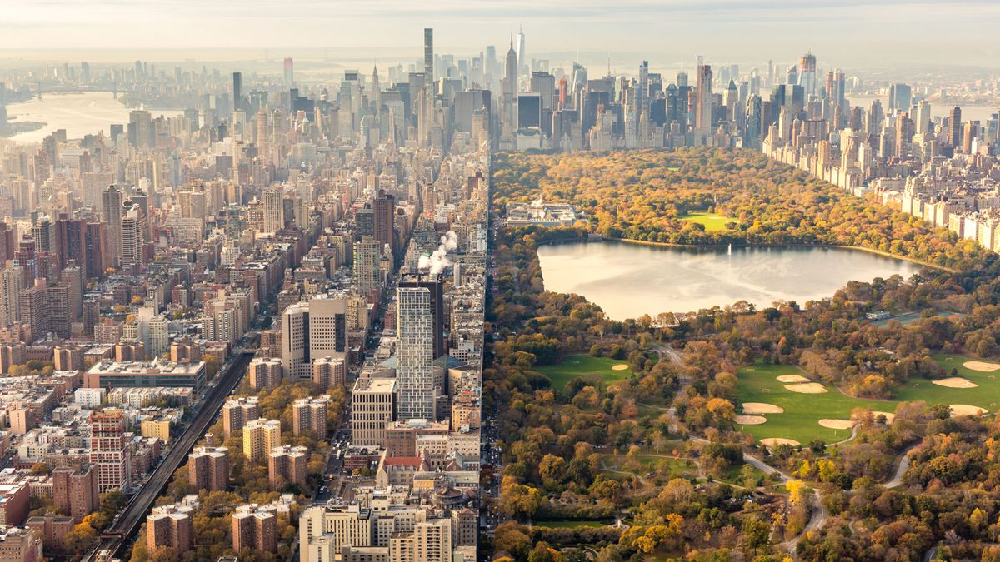

# Photomosaic

 Photomosaic - a large-scale detailed picture or map built up by combining photographs of small areas. 

   

 Program starts by taking target image and splits it into a grid. Then finds RGB color average of each input image. It then loops 
through each grid item and finds best replacement out of the input images. A K-D Tree is used to find nearest neighbors index. 

 User can decide grid size, resulting in more or less accurate photomosaic. As well as having the option of naming the new image 

  
  
  

  
  

## Usage

 main.py --target-image TARGET_IMAGE --input-folder INPUT_FOLDER --grid-size GRID_SIZE GRID_SIZE [--output-file OUTFILE] 

